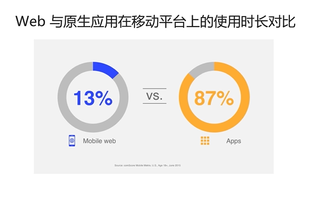

## PWA介绍

> PWA 全称Progressive Web Apps(渐进式Web应用程序)

### 下一代web应用  
#### 一、近年来web技术爆发式发展  
> 1）webpack、rollup 等打包工具  
2）Babel、PostCSS等转译工具  
3）TypeScript等可转译为javascript的编程语言  
4）React 、Vue、Angular等现代web前端框架  
5）同构javascript应用（服务端渲染）  

#### 二、web应用体验依然不佳  
> 1）网页资源下载带来的网络延迟  
2）web应用依赖于浏览器作为入口  
3）没有好的离线使用方案  
4）没有好的消息通知方案  
5）……  

#### PWA的出现  
> 1）显著提高应用加载速度  
2）web应用可以在离线环境下使用  
3）web应用能够像原生应用一样被添加到主屏  
4）web应用能在未被激活时发起推送通知  
5）web应用与操作系统集成能力进一步提高

#### PWA案例 -- FlipKart  
> 1）根据提示或手动添加至主屏  
2）全屏打开，不受困于浏览器的UI  
3）无法访问网络时，可以像原生应用一样照常执行  
4）商品降价、促销等时刻，像原生应用一样发送通知  

PWA模型将成为继20年前横空出世的ajax与约10年前风靡移动互联网的响应式设计之后，掀起web应用模型的第三次根本性革命，将web应用带入一个全新的时代。

## PWA关键技术
### Web App Manifest
> Web App Manifest，即通过一个清单文件向浏览器暴露web应用的元数据，包括名字、icon的URL等，以备浏览器使用，比如添加至主屏或者推动通知时暴露给操作系统，从而增强web应用与操作系统的集成能力。